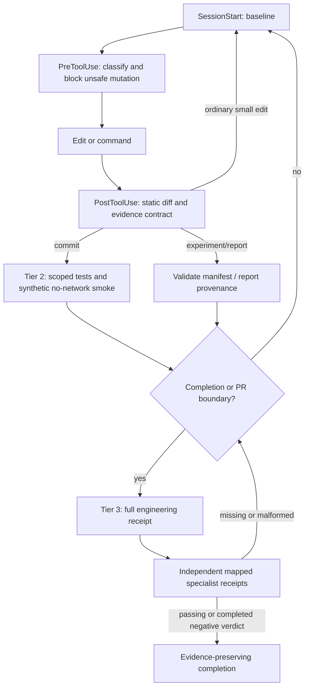

# Codex research-integrity hooks

## Purpose and boundary

This is a quality gate for offline research, not a trading control plane. It protects
the link between a hypothesis, its code, the data available at the decision time, the
execution assumptions, and the claim made from the result. It never starts bots, places
orders, changes a dataset/cache, reads raw journals, runs generic research runners, or
launches a nested Codex agent.

The project configuration is `.codex/hooks.json`; its dispatcher is
`.codex/hooks/research_guard.py`; policy and mappings live in
`.codex/hooks/policy.json`. The dispatcher is deliberately standard-library only and
keeps its session state, reusable success receipts, and bounded audit ledger in the OS
temporary directory rather than in the repository. Failed checks are never reusable;
completed negative research evidence is preserved in the ledger.

Codex hooks execute only in a trusted project after their one-time `/hooks` review.
That is a product security boundary: versioning this configuration does not silently
authorize arbitrary commands on another workstation. Codex currently executes command
hooks; Skills and specialist agents are routed through `SubagentStart`/`SubagentStop`
context and structured receipts, not invoked recursively from a hook.

### Claude Read guard

`.claude/hooks/read_guard.py` is a separate Claude Code `Read` pre-tool guard, wired by
`.claude/settings.json`. It blocks raw backtest journals and files at or above 150 KB so
the assistant uses summaries, slices, or targeted searches instead. Codex does not run
that hook; do not copy it into `.codex/hooks/` unless a Codex event explicitly wires it.

## Execution graph



The only repeated path is Tier 1. Tier 2 is content-addressed and runs once per exact
scope/interpreter/policy fingerprint. Tier 3 is reserved for a completion or publication
boundary. A failed receipt never enters the cache.

## Controls

| Order | Control | Trigger and scope | Tier / maximum runtime / frequency | Block or warning | Validation and output | Cache / reuse |
| --- | --- | --- | --- | --- | --- | --- |
| 10 | `integrity-classify` | Session start and supported pre/post tool events; current tool paths, staged diff for commit, publish diff for PR | Tier 1, 1.5s, every event | Warns; protected mutations block | Safe normalized paths; staged, unstaged, untracked, deleted and rename classification; session baseline | Session-local until HEAD changes; reusable |
| 20 | `integrity-static-diff` | Before and after strategy, indicator, dataset, optimizer, risk, execution, backtest, dependency, parameter and hook edits | Tier 1, 1.8s, every relevant edit | Blocks protected files, secret-like input, `requests`, Python syntax and new 800-line breaches; warns on research-risk markers | Changed-category record and model-visible reason | No cache: each patch is distinct |
| 30 | `integrity-targeted` | Before `git commit` and at task stop for non-doc material scope | Tier 2, 30s, once per exact fingerprint | Blocks failed/timeout focal tests, synthetic smoke side effects, or forbidden artifact/network behaviour | Allowlisted affected tests, changed-path static checks, deterministic in-memory `BacktestEngine` smoke for backtest-related edits | Exact content/policy/interpreter fingerprint; only success reuses |
| 40 | `evidence-contract` | After recognized experiment or report command, only referenced manifest/report | Tier 2, 10s, once per artifact | Blocks feedback when provenance is absent or inconsistent | Immutable run/result identity, repository/dataset/environment/external-input identity, safe artifacts; report cites source run id and result hash | Exact manifest hash; mutable input identity invalidates reuse |
| 50 | `completion-engineering` | Explicit `validate --tier 3`, PR readiness, or completion continuation | Tier 3, 900s, boundary only | Blocks | Full pytest, compileall, package build, `pip check`, Ruff ratchet | Exact publish fingerprint and supported Python environment |
| 60 | `research-verdict` | Material task completion and PR boundary | Tier 3, up to 7200s, boundary only | Blocks continuation until receipts exist | Specialist identity, required JSON fields, permitted verdict vocabulary, exact evidence fingerprint, visible limitations and known blockers | Per-specialist immutable evidence fingerprint |

## Category routing

| Changed category | Tier 1 | Tier 2, only when that category changed | Tier 3 / independent gate |
| --- | --- | --- | --- |
| Strategy / Swing | frozen-default and parameter markers | strategy/Swing focused tests | code review + backtest integrity; Swing domain validator for Swing claims |
| Indicators | static Python and closed-period marker check | `test_indicator_time_contracts.py` | data-integrity and backtest-integrity verdicts |
| Datasets / external context | protected canonical cache and static checks | data and funding focused tests | data-integrity audit; point-in-time/revision identity required |
| Optimizers / parameter sweeps | parameter-diff classification | runner/manifest focused tests only | robustness statistician; walk-forward, bootstrap, Monte Carlo, rolling starts and full sweeps only under a frozen Tier 3 contract |
| Risk | risk-control classification | risk/prop-rule focused tests | portfolio-risk specialist |
| Execution | execution-assumption classification | fill/client-contract focused tests | execution-model and backtest-integrity specialists |
| Backtest engine | static engine checks | execution, PnL, client-contract, runner and manifest tests plus no-network synthetic smoke | full engineering plus backtest-integrity specialist |
| Dependency | dependency/static diff | settings and Ruff-ratchet focused tests | full build and `pip check` |
| Reporting | safe report path and secret checks | manifest/report focused tests | evidence curator; report must be linked to source evidence |
| Hook/docs only | static hook checks | hook contract test; docs alone have no Tier 2 test plan | Tier 3 only at explicit publish/completion, never after each edit |

## Research integrity rules

- Before edits, protected paths are denied: secrets, runtime databases, canonical caches,
  raw journals, logs, graph output, deployment, and frozen Pro Trend. Frozen Swing v6-2
  default markers are separately denied. These are workflow guardrails, not a substitute
  for human approval where `AGENTS.md` requires it.
- After an edit, Tier 1 only parses the touched content. It never launches a build, full
  test suite, backtest, optimization, network request, or data audit.
- Tier 2 uses reduced, allowlisted tests. Its backtest smoke creates in-memory bars,
  disables socket and `urllib`, runs twice for deterministic output, and fails if a
  manifest, journal, or report appears.
- Shell classification allowlists exact validation and read-only CLI forms. Full or scoped
  pytest, compileall, isolated package build, dependency checks, Ruff, help, and the documented
  local status commands are accepted; arbitrary Python, pytest plugins/options, mutating CLI
  commands, non-isolated builds, and targets outside `tests/` fail closed.
- Tier 2 and Tier 3 test/analysis child processes load a temporary `sitecustomize` that denies
  socket connections and DNS resolution. Package installers also receive offline flags. The exact
  isolated distribution-build command is the only exception because a clean PEP 517 environment
  may need to provision the declared `setuptools` and `wheel` requirements. This prevents accidental
  test network use; it is not an OS sandbox for hostile native executables.
- Tier 3 preflights Python 3.12/3.13 plus `pytest`, `build`, and `ruff` before issuing a receipt.
  Distribution builds remain isolated, matching CI; missing local build tools or cached build
  requirements fail visibly instead of silently switching to the ambient environment.
- A research manifest must self-validate: schema/run id and result hash must recompute;
  repository worktree and dataset hashes must exist; Python must be 3.12/3.13; dependency
  identity cannot contain `NOT_INSTALLED`; extant external inputs need SHA-256. Swing
  manifests additionally require `final_btc_qty`, `bnh_initial_btc`, and
  `btc_vs_bnh_ratio`; the funding overlay needs a hashed Bybit input.
- A generated report is evidence only when it cites a validated manifest run id **and**
  result hash. The hook does not reopen raw journals to recompute their hashes.
- Specialist receipts distinguish `completed` from `gate_passed`. `REJECT`, `INVALID`,
  `FRAGILE`, `NOT_FIT`, `UNDERMODELLED`, and `INCOMPLETE` are completed negative evidence,
  must be retained, and prohibit a supporting/promotion claim. They do not disappear just
  because the task can close as rejected or inconclusive.

`fill_next_open` causality is fixed and covered by focused execution tests; it is not an open
hook blocker. Known blockers remain explicit: Scalp multi-timeframe alignment, external-input
provenance unavailable for legacy manifests, and the material known defect of 474 identical OHLCV
rows in the canonical cache. The canonical cache has not been rewritten. A new multi-asset universe
also requires point-in-time membership and delisted-asset coverage before survivorship claims
are accepted.

## Examples: why isolated work stays cheap

- A documentation edit runs only Tier 1. It never triggers pytest, build, a backtest, or
  research validation.
- A one-file indicator edit runs Tier 1 per edit. At commit/task stop, it runs the one
  indicator time-contract suite; it does not run walk-forward or parameter sweeps.
- A backtest-engine edit runs its focal execution/PnL/client/manifest tests and the small
  no-network smoke once. It does not run a large cached backtest automatically.
- A PR or explicit research completion reuses an exact Tier 3 success when possible;
  otherwise it runs the full engineering checks and asks the minimum mapped independent
  specialists for receipts. Expensive robustness analysis is still opt-in through a frozen
  research contract, not a side effect of editing code.

## Operation, limits, and rollback

Inspect policy with:

```powershell
python .codex/hooks/research_guard.py describe
python .codex/hooks/research_guard.py validate --tier 2 --reason local-check
python .codex/hooks/research_guard.py validate --tier 3 --reason completion
```

Tier 3 requires Python 3.12 or 3.13. On a host with only Python 3.14, Tier 1/2 may emit an
unsupported-interpreter warning for local feedback, but the host cannot issue a valid Tier 3
receipt. Use the project `.venv`, Python launcher, or CI's 3.12/3.13 environment instead.

This implementation does **not** install native Git hooks, modify CI, push branches, open PRs,
or mutate Codex trust settings. The existing CI remains an external backstop; path-filtering it
would be a separate CI change requiring approval. To roll back locally, disable project hooks
through Codex's hook settings or remove/revert these versioned hook files; do not delete the
OS-temporary audit evidence merely to obtain a green result.

Codex hook behaviour, trust, event payloads, and continuation semantics are governed by the
[official Codex Hooks reference](https://learn.chatgpt.com/docs/hooks.md).

### Local-state lock safety

Hook state uses atomic lock-directory creation plus an owner record containing PID, host, session,
process-start identity when the OS exposes it, and a refreshable heartbeat. A heartbeat older than
60 seconds is diagnostic only: a live owner is never reclaimed merely because it is paused.
Recovery is allowed only after liveness verifies the owner is dead or its process-start identity
mismatches (PID reuse). Malformed or cross-host owner state fails closed and times out. On Windows,
the hook uses a conservative `tasklist`/`GetExitCodeProcess` liveness path; Windows does not expose
the POSIX `/proc` start identity, so a live PID is conservatively retained. The temporary state
directory is host-local; it is not a
distributed lock.
