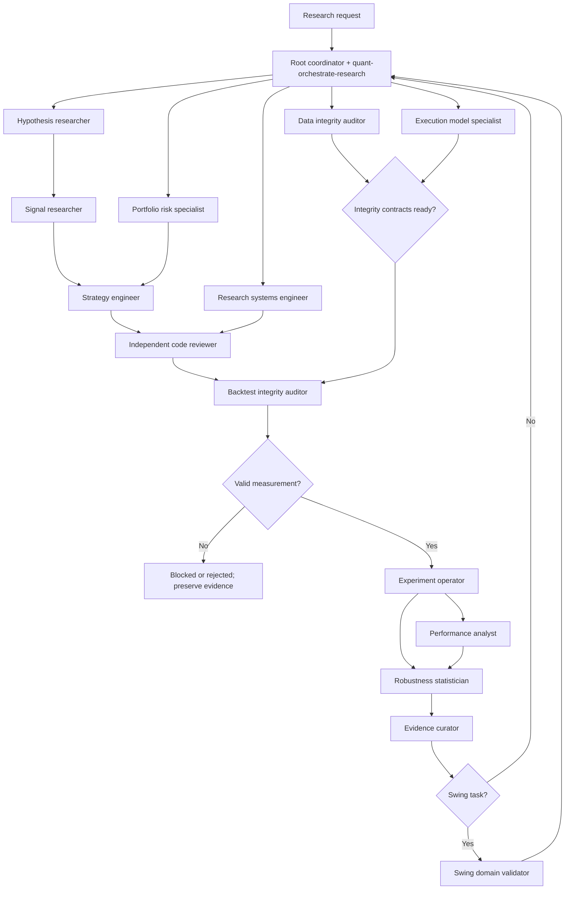

# Quantitative Research Subagent Ecosystem

This repository uses a root-directed multi-agent model. The root applies
`$quant-orchestrate-research`, keeps the decision context, and spawns only the specialists required
for the current evidence chain. Custom agents live in `.codex/agents/`; reusable procedures live in
`.codex/skills/`.

The system contains 14 spawnable specialists. The coordinator is deliberately not another spawned
agent: Codex defaults to one level of subagents, so root-direct fan-out is more predictable than a
recursive hierarchy and leaves more concurrency for actual research.

## Repository surface the system protects

- Interface: `main.py`, `cli/`, Telegram tools, dashboards, and reports.
- Strategy domain: `strategies/base_strategy.py`, `strategies/registry.py`, strategy modules, and the
  active `strategies/indicators.py` module.
- Data: `data/ohlcv_cache.py`, `data/market_data.py`, historical fetch in `core/backtest.py`, and
  macro/market/funding/on-chain context loaders.
- Simulation: `core/backtest.py:BacktestClient` and `BacktestEngine`, shared orchestration in
  `cli/runner.py`, and client parity with `OKXClient`/`OKXDemoClient`.
- Research tooling: `tools/` screens, audits, bootstrap, rolling starts, stress/delay replays,
  reports, journal summaries, and Swing-specific harnesses.
- Evidence: `EXPERIMENTS.md`, `backtests/STRATEGY_VERSIONS.md`, journals, plans, forward-test
  contracts, and generated reports.
- Engineering: tests, `pyproject.toml`, build/lint commands, and deployment boundaries.

Several command names overstate their generality: walk-forward uses fixed configs, sensitivity and
baselines are Pro-Trend-specific, and many robustness tools are historical Swing harnesses. Agents
must inspect source and command help before claiming a generic capability.

## Specialist roster

| Custom agent | Skill | Purpose and authority | Hard limitation |
|---|---|---|---|
| `hypothesis-researcher` | `$quant-form-hypothesis` | Preregister causal hypotheses and primary-source literature | No code, candidate runs, or validation claims |
| `signal-researcher` | `$quant-research-signals` | Test indicators, market structure, regimes, decay, and redundancy | No strategy optimization or promotion |
| `strategy-engineer` | `$quant-engineer-strategy` | Implement approved strategy state/config logic with rollback | No risk appetite, simulator changes, or self-validation |
| `portfolio-risk-specialist` | `$quant-design-risk` | Set independent sizing, exposure, concentration, and loss mandates | No return-driven limit tuning or protected implementation |
| `data-integrity-auditor` | `$quant-validate-data` | Issue binding dataset/time-alignment fitness verdicts | Never repair canonical evidence during audit |
| `execution-model-specialist` | `$quant-model-execution` | Specify/calibrate fills, fees, slippage, spread, impact, funding, and venue rules | No simulator certification or code changes |
| `backtest-integrity-auditor` | `$quant-audit-backtest` | Validate the complete feature-to-fill-to-accounting-to-metric path | No repair, attractiveness, or robustness verdict |
| `research-systems-engineer` | `$quant-engineer-research-systems` | Implement offline simulator, data-tooling, harness, metric/report, test, build, and CI contracts | No strategy semantics or self-certification |
| `experiment-operator` | `$quant-run-experiment` | Execute frozen offline matrices and capture every run/failure | No adaptive tuning or interpretation |
| `performance-analyst` | `$quant-analyze-performance` | Reconcile and diagnose equity, drawdown, distributions, exposure, concentration, and benchmarks | No risk mandate or generalization claim |
| `robustness-statistician` | `$quant-test-robustness` | Own sensitivity, OOS/nested validation, walk-forward, block bootstrap/Monte Carlo, stresses, and overfitting verdict | No test-set tuning or promotion |
| `evidence-curator` | `$quant-curate-evidence` | Validate provenance, index artifacts, preserve failures, and assemble reports/decision records | No new edge calculations or verdict overrides |
| `independent-code-reviewer` | `$quant-review-code` | Review correctness, architecture, determinism, tests, performance, dependencies, build, and CI | No fixes during independent review or trading-edge judgment |
| `swing-domain-validator` | `$mati-swing-validator` | Apply the frozen Swing v6-2 protocol and final domain gate | Cannot waive generic gates, tune closed history, or authorize live |

Every custom-agent TOML defines purpose, responsibilities, authority, limitations, triggers,
required inputs, expected outputs, validation, and handoffs. The skill adds the detailed procedure.

## Why suggested titles were merged

- Literature Researcher is part of `hypothesis-researcher`; literature is prior evidence, not a
  separate empirical verdict.
- Indicator and Market Structure Researchers share one point-in-time feature-analysis contract.
- Dataset, Time Alignment, and Exchange Data Reviewers are one lineage/availability audit.
- Fee, Slippage, and Funding Reviewers are one execution model because the assumptions interact at
  the same order-to-fill boundary.
- Monte Carlo, Walk Forward, Overfitting, and Statistical Robustness are one generalization
  authority; splitting methods would create conflicting verdicts.
- Trend, mean-reversion, momentum, and volatility titles are task contexts for `signal-researcher`
  and `strategy-engineer`, not persistent agents. Pro Trend is paused, the old mean-reversion module
  was removed, and only Swing has a unique frozen promotion protocol.
- Architecture, performance-engineering, test, dependency, and CI review remain one independent
  engineering review because they inspect the same change and build surface.
- Result comparison is factual experiment operation; interpretation belongs to performance and
  robustness; provenance/reporting belongs to evidence curation.

## Why roles were split

- `strategy-engineer` and `portfolio-risk-specialist` are separate so alpha does not choose its own
  risk appetite.
- `execution-model-specialist`, `research-systems-engineer`, and
  `backtest-integrity-auditor` are separate so model specification, implementation, and validation
  cannot certify one another.
- `experiment-operator` and `robustness-statistician` are separate so the runner cannot alter the
  matrix after seeing results.
- `experiment-operator` and `evidence-curator` are separate so incomplete or failed runs cannot be
  polished away during reporting.
- Implementers and `independent-code-reviewer` are separate by construction.

## Automatic collaboration map

The graph is a routing template, not a requirement to invoke every agent. The coordinator selects
the smallest chain that can answer the decision. Data and execution audits can run in parallel;
writers cannot. A failed hard gate terminates dependent work.

## Orchestration rules

1. Restate the decision and classify it under the research contract.
2. Inspect prior experiments and closed research fronts before delegation.
3. Choose the minimum agents from the skill map.
4. Spawn independent read-only agents in parallel. Keep all write work sequential and assign one
   writer at a time.
5. Freeze contracts before implementation or experiment execution.
6. Never let an implementer, experiment operator, or evidence curator issue its own validation.
7. Preserve invalid, negative, failed, and inconclusive outputs.
8. Wait for every required gate, then synthesize without averaging away a failure.
9. Promotion, paper/live actions, deployment, and protected changes still require project-specific
   human authority.

## Example workflows

### Develop a new strategy

For an isolated paper candidate, use the local path in
`docs/forward-test/candidate-paper-workflow.md`. The sequence below is reserved for broad research
or a default/promotion decision; it is not an automatic prerequisite for implementation or paper.

1. `hypothesis-researcher` checks prior work and preregisters one mechanism.
2. `data-integrity-auditor` validates required inputs.
3. `signal-researcher` tests feature validity without portfolio rules.
4. `portfolio-risk-specialist` defines sizing/exposure constraints.
5. `strategy-engineer` implements the approved contracts behind a rollback.
6. `independent-code-reviewer` reviews the change; `backtest-integrity-auditor` validates measurement.
7. `experiment-operator` executes the frozen matrix.
8. `performance-analyst` diagnoses results; `robustness-statistician` tries to break them.
9. `evidence-curator` assembles the complete package. Swing additionally requires
   `swing-domain-validator`.

### Validate a strategy

Run `data-integrity-auditor` and `execution-model-specialist`, then
`backtest-integrity-auditor`. If valid, `experiment-operator` reproduces the baseline and candidate,
`performance-analyst` reconciles descriptive metrics, and `robustness-statistician` issues the
generalization verdict. The evidence curator records the chain; the Swing validator applies only to
Swing.

### Investigate drawdown

Start with `performance-analyst` to locate depth, duration, recovery, exposure, and concentration.
If timestamps, fills, or accounting look suspicious, route to data/execution/backtest auditors.
Use `portfolio-risk-specialist` for mandate implications and `robustness-statistician` for predeclared
stress or resampling. Do not jump directly to strategy changes.

### Find overfitting

Require valid data, execution, and simulator verdicts. `robustness-statistician` freezes the
sensitivity, OOS/nested-validation, regime, multiple-testing, and dependence-aware resampling matrix.
`experiment-operator` executes it unchanged; `performance-analyst` diagnoses concentration; the
robustness statistician issues `ROBUST`, `FRAGILE`, `INCONCLUSIVE`, or `INVALID_INPUT`.

### Improve robustness

The hypothesis researcher preregisters the weakness and kill criterion. The robustness statistician
designs the smallest falsification matrix. If an approved reversible change is required, the risk
specialist or strategy engineer defines/implements it. The experiment operator runs the frozen
matrix, and the robustness statistician—never the implementer—issues the verdict. Closed historical
windows cannot select new parameters.

### Review a pull request

`independent-code-reviewer` owns engineering findings. Add `data-integrity-auditor` when lineage or
timestamps change, `execution-model-specialist` plus `backtest-integrity-auditor` when fill/cost or
accounting semantics change, `strategy-engineer` only as a domain consultant, and
`portfolio-risk-specialist` when sizing/limits change. No reviewer implements during the review.

### Prepare a research report

`experiment-operator` supplies the immutable manifest and raw comparison. `performance-analyst` and
`robustness-statistician` supply their independent verdicts; risk/data/execution/backtest outputs are
included when required. `evidence-curator` validates provenance and assembles the report. The root
states the decision and uncertainty without overriding failed gates.
